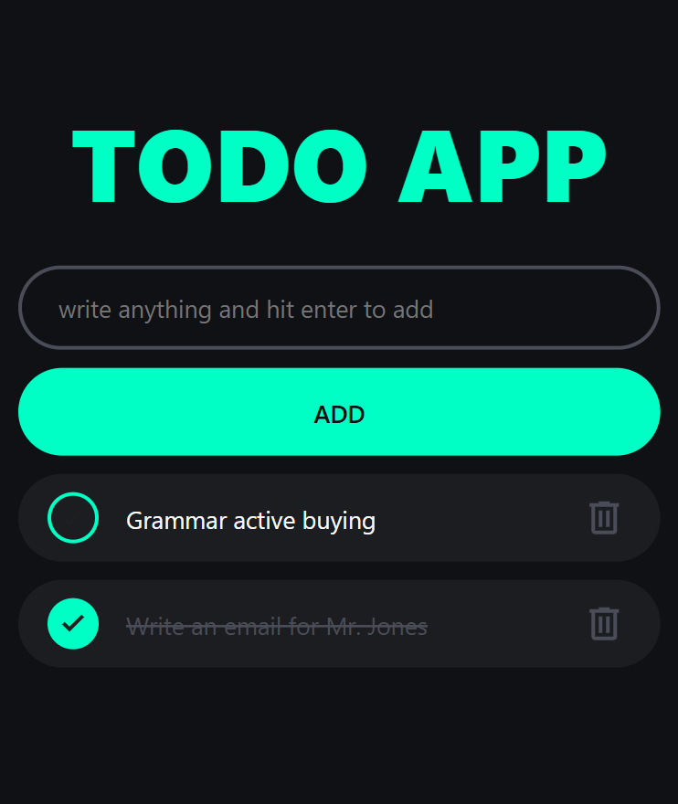

# 📝 Todo App( JavaScript ) 

>### click [_here_](https://sardarhassanzada2005-web.github.io/Todo-App/) to see demo

### Overview
    This is a simple Todo application built to practice JavaScript fundamentals,
    especially DOM manipulation and basic CRUD operation.

###  Features
    - Add, edit, delete tasks
    - Mark tasks as completed
    - Save tasks using LocalStorage so data is not lost on refresh
### Technologies
    - HTML
    - CSS
    - JavaScript
### What I Learned
    - How to select and update  DOM elements using JavaScript
    - How to Organize JavaScript code with functions
    - How to store and retrieve data using LocalStorage
    - How to work with addEventListener
### purpose
    This project is part of my preparation for a Junior JavaScript / Ausbildumg

### Next Step
    - Multi-language support
    - Improved code structure  ( separating logic and UX )
    - Dark mode
    
_This project will be improved step by step as I continue learnig._

